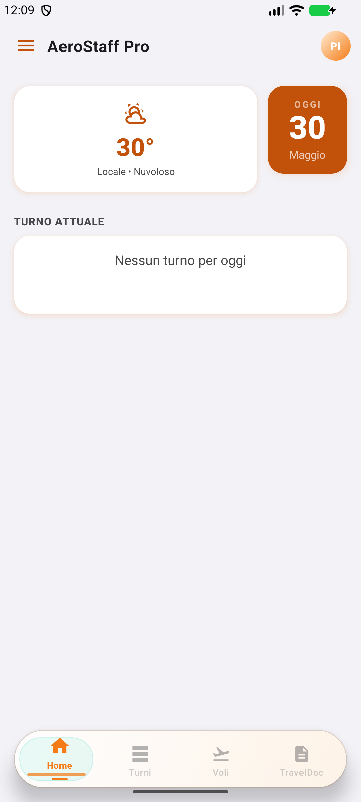
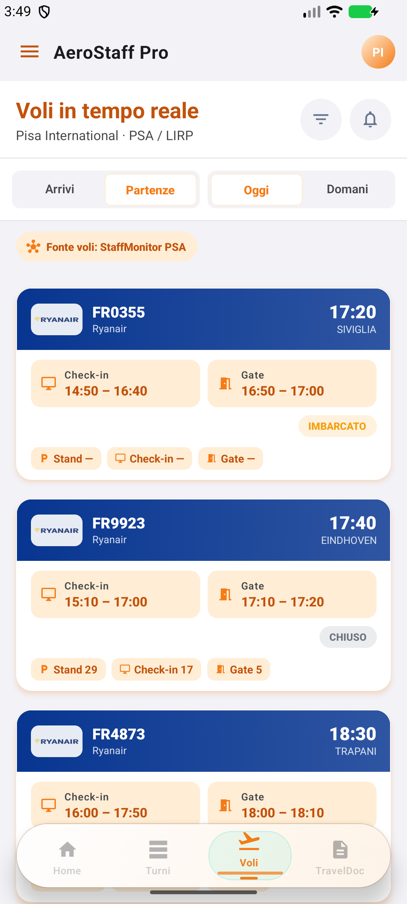
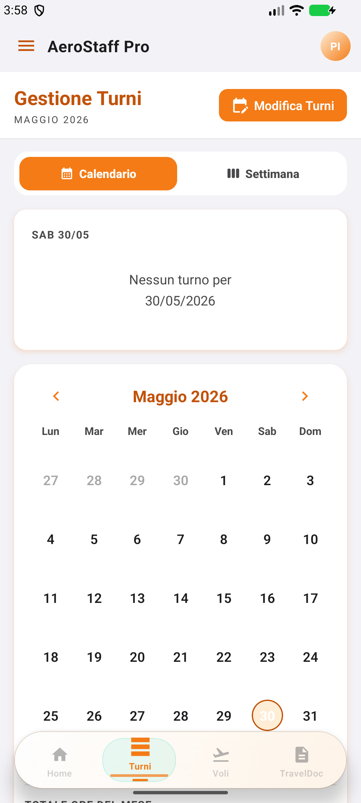

# AeroStaff Pro

AeroStaff Pro is a premium React Native application designed specifically for airport ground staff and flight crew shift operations. It brings together operational schedules, real-time flight telemetry, custom widgets, Wear OS integration, and daily workspace tools into a singular, glassmorphic cockpit interface.

## Key Features

- **Dynamic Shift Scheduling**: Seamlessly track shift rosters using interactive **Month** and **Week** views. Includes real-time visual timeline indicators, weather overlays, and flight workload summaries.
- **Roster File Parsing**: Automatically import and convert official roster schedules and PDF files into interactive calendar events using offline parser engines.
- **Real-Time Flight Telemetry**: Track operative departures and arrivals directly from the airfield with support for multi-source data fallbacks (FR24 API, StaffMonitor PSA, AeroDataBox, and AirLabs).
- **EasyJet Overlap Mode**: A high-precision monitoring system that automatically triggers when multiple easyJet flights overlap in the same time frame. It displays a real-time orange dashboard monitor with exact-second countdowns and schedules unified sticky notifications in the system tray.
- **Deep Airline App Links**: Open specific flights and routes directly inside native tracking platforms like Flightradar24 with single-touch handlers.
- **Android Widgets & Wear OS Companion**: View current shift timelines, flight schedules, and next-shift widgets right from the home screen or on a Wear OS smartwatch.
- **Crew Operations Chest**: Store operational manuals (DCS reference, ground handling checklists), notepad, personal contacts, and credentials securely.
- **Smart Notification Engine**: Configure customized arrival, departure, and shift reminders with precise timing.

## Interface Preview

<p align="center">
  
  &nbsp;&nbsp;&nbsp;&nbsp;
  
  &nbsp;&nbsp;&nbsp;&nbsp;
  
</p>

## Development Note

This is not an AI app. AeroStaff Pro does not include a chatbot, language model, AI decision-making, or AI features for end users.

Claude and Codex are used as development tools for planning, implementation, debugging, refactoring, documentation, and release work. They help build the project, but they are not part of the shipped app experience.

## Tech Stack

- Expo SDK 54
- React Native 0.81
- React 19
- TypeScript
- Android native code
- Wear OS module
- Android widget support

## Requirements

- Node.js 20 recommended
- npm
- Android Studio with the Android SDK
- Java 17 or newer

## Getting Started

```bash
git clone https://github.com/TargetMisser/AeroStaffPro.git
cd AeroStaffPro
npm ci
npm run start
```

Run on Android:

```bash
npm run android
```

Run the web preview:

```bash
npm run web
```

Run Storybook:

```bash
npm run storybook
```

## Useful Commands

```bash
npm run typecheck
npm test
npm run test:smoke
npm run release:check
npm run github:branches:audit
```

## Releases

APK files are published in [GitHub Releases](https://github.com/TargetMisser/AeroStaffPro/releases).

Latest stable release: **v2.7.16**

To install the Android app:

1. Open the Releases page.
2. Download `AeroStaffPro-vX.X.X.apk`.
3. Install it on the Android device. You may need to allow installs from unknown sources.
4. If using Wear OS, keep the phone and watch paired so the companion module can be installed.

## Local Android Release Build

Set the signing environment variables first:

```powershell
$env:RELEASE_STORE_FILE="C:\path\to\release.keystore"
$env:RELEASE_STORE_PASSWORD="your-keystore-password"
$env:RELEASE_KEY_ALIAS="your-key-alias"
$env:RELEASE_KEY_PASSWORD="your-key-password"
```

Then build:

```powershell
cd android
.\gradlew.bat assembleRelease
```

The APK is generated at:

```text
android/app/build/outputs/apk/release/app-release.apk
```

The GitHub Actions release workflow expects these repository secrets:

```text
KEYSTORE_BASE64
KEYSTORE_PASSWORD
KEY_ALIAS
KEY_PASSWORD
```

## Repository Notes

- `main` is the public stable branch.
- Feature and experiment branches should be short-lived.
- Local logs, keystores, downloaded APKs, and temporary files should not be committed.
- API keys are configured by the user inside the app or through local environment setup, not stored in the repository.
- Release APKs live in GitHub Releases, not in git.
